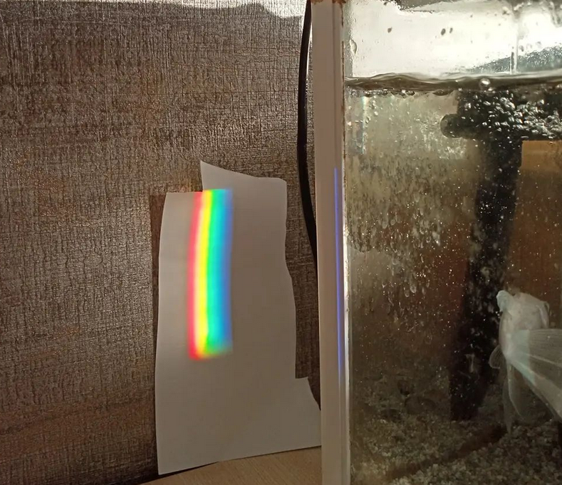

# Rainbow-Utils

 
Refraction... It is apparently the most inspiring phenomenon of the light. Rainbow appears with refraction after the rain. We can see all of the spectrum. Wishing to simulate it, Rainbow-Utils created.
## Docs
<pre>
Continuum----|
             |----layers()
             |----add(material)
             |----evaluate_field(incoming_E)
</pre>
<h3>Continuum()</h3>
   Creates a virtual planar environment for materials. The environment simulates 2D wave vectors 
<h4>add(material)</h4>Adds a new material
 <ul><code>material</code>: Indicates which material is added. Materials can be added 1 by 1 or in list. For example either <code>Env.add(Vacuum)</code> or <code>Env.add([Glycol, Water, Vacuum])</code></ul>
 <ul><code>evaluate_field(incoming_E)</code>: It computes final state of incoming wave vector**</ul>
 <ul><code>incoming_E</code>: It is incoming wave vector. It is a 2D vector. It can be in the form of <i>tuple</i>, <i>list<i> or <i>np.array<i> </ul>
 
